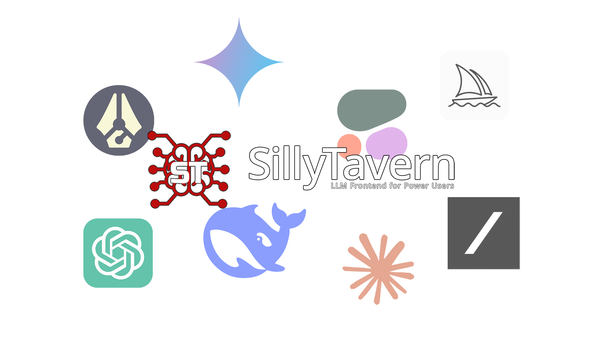
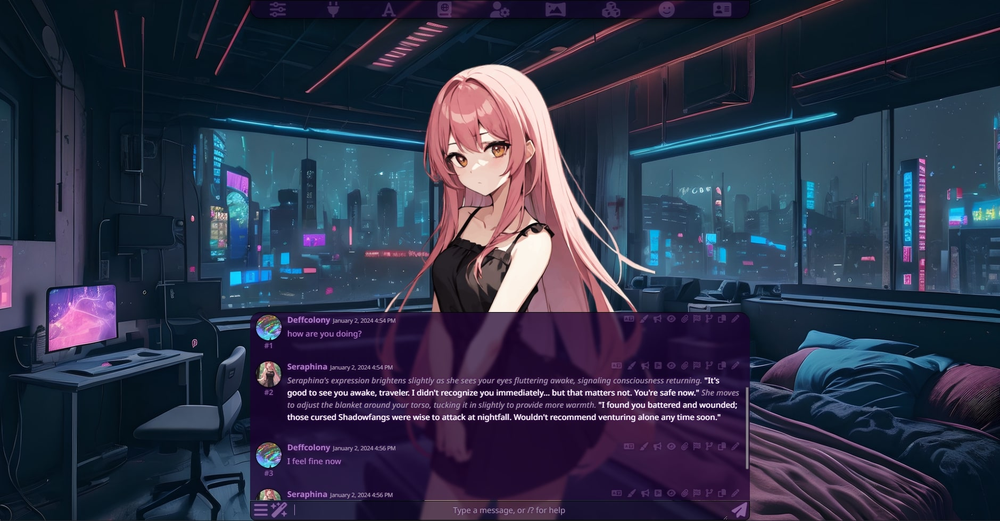
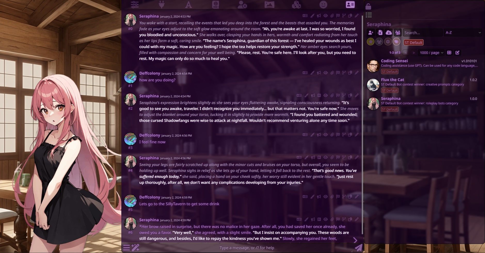
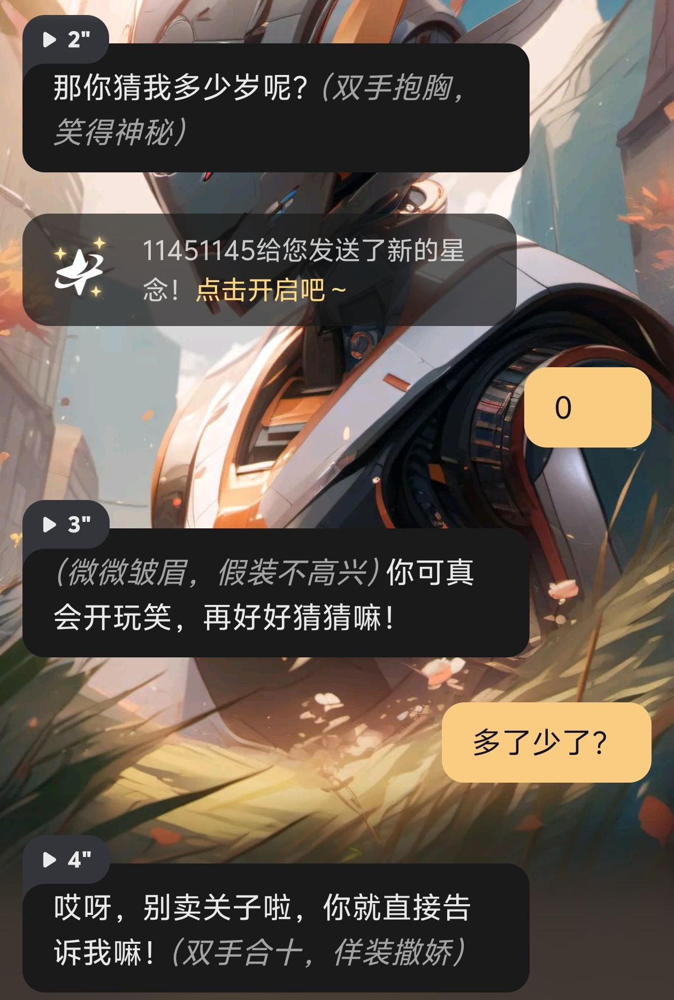
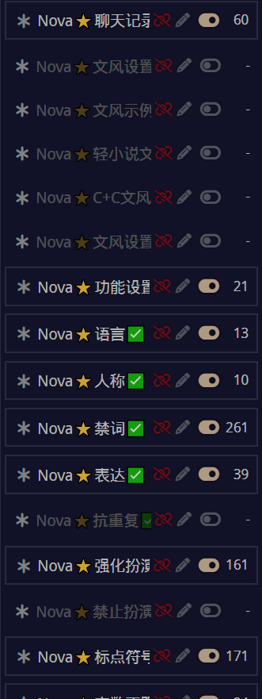
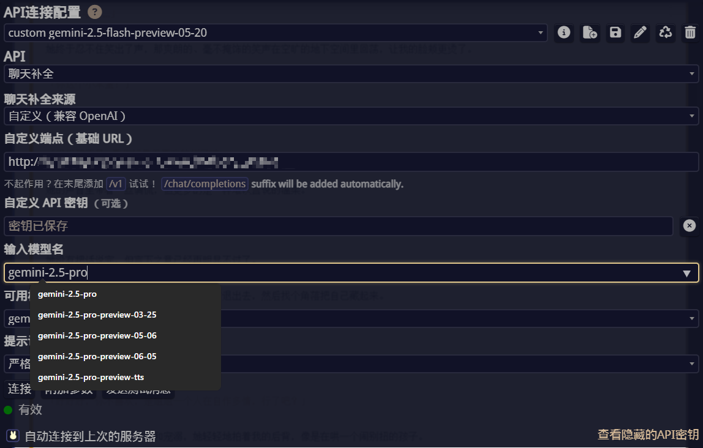

# 什么是酒馆？
[SillyTavern](https://github.com/SillyTavern/SillyTavern)
在中文互联网被称作 **“赛博酒馆”**
一个开源的、本地化的 AI 聊天界面，用于与自定义AI模型进行互动，并与自定义角色（角色卡）进行聊天或角色扮演游戏

# 它能用来干什么？
与星野等智能体社区平台相似 玩法就是找卡 玩卡

  
  
  

星野做的确实不错 算是我认为比较早期把ai导向角色扮演的 可免费使用 无较多限制且具有一定的社区体量
不过和酒馆相比的话还是差了点 不止是“自由性”
我在早期尝试过星野 或许是当时的模型逻辑性还没那么强（也可能是星野内置prompt太烂了）
算50次对话（即50条往来消息）为一轮的话 星野的模型在不到1/5就能出逻辑性问题
如动作对象不符合（如“你做”被记作“我做”） 忘记上文等 
我本以为如今这种问题在前几次对话不会出现
失望的是星野现在的模型和早期体验几乎没差（怎么还全给我推女性向的角色卡？）

就像chatgpt热度刚上来的时候的gpt2 不给任何prompt的情况下能让故事背景中相隔千里的两人凭空对话（？
而SillyTavern的自定义模型 prompt（被称为预设）则提供了减少甚至**避免**逻辑性问题的解决方案

  
  

且由于ai模型为自己配置 不必担心用乐色春竹模型

# 配置API
**注意 以下步骤大多都需要“魔法” 即使你找到了懒人包 中文角色卡的获取来源大多也需要墙外环境**
**Android和PC都能配置 iOS请前往Discord类脑社区自行寻路**
[SillyTavern中文文档](https://st-docs.role.fun/) 
[Discord类脑社区](https://discord.gg/6kdVgVgcRx) [类脑Wiki](https://wiki.xn--35zx7g.org/)
本教程以免费 长上下文的Google Gemini为例
TBC...