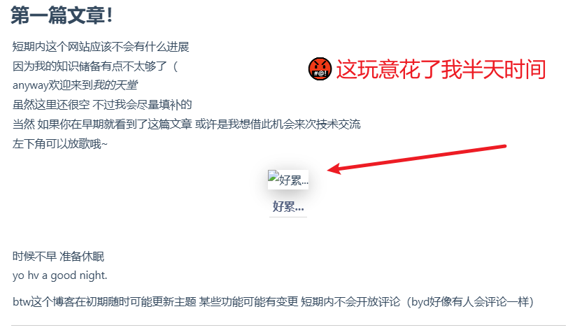
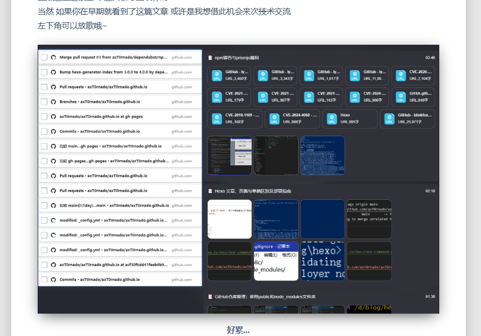
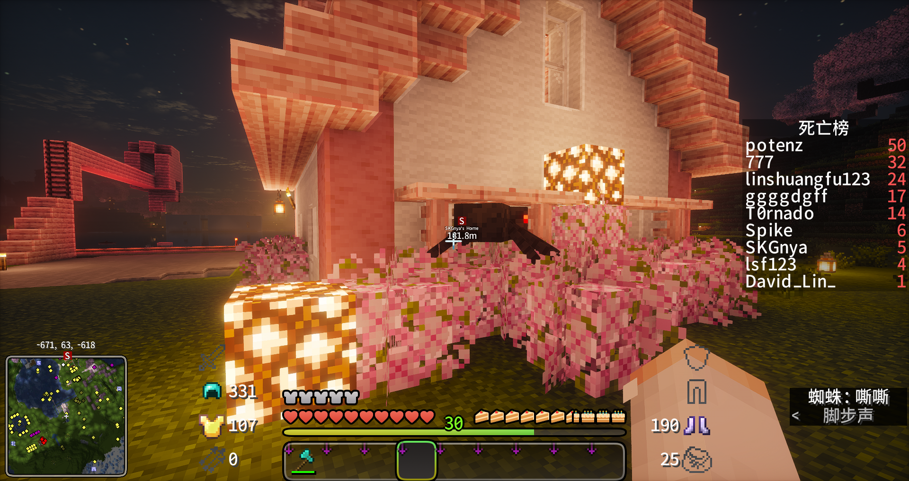
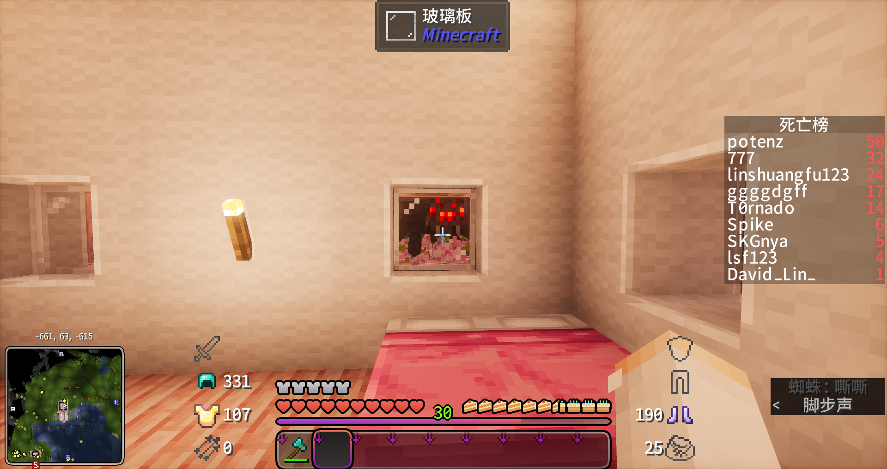

# 本篇为hexo教程篇
## 关于图片路径问题
##### 本博客已*暂时*解决此问题（但愿不会**复发**）

原版的hexo-generator对image的路径处理似乎有些问题
即使在帮助文档中更新了插入图片的方法仍然容易出现下图情况


***

## 解决方案
原理：使用 **[github大佬的image插件](https://github.com/CodeFalling/hexo-asset-image)** 进行图片路径处理

```
npm install https://github.com/CodeFalling/hexo-asset-image
hexo clean
hexo g
hexo s

```

检查日志中的**update link as**字样 后面跟着的应该是使用public文件夹路径（应包括以文章日期为文件夹名称的路径）

在本地博客里图片也应正常显示

教程结束！感谢阅读
  
  
  
  
附上偷窥别人睡觉的蜘蛛🕷


