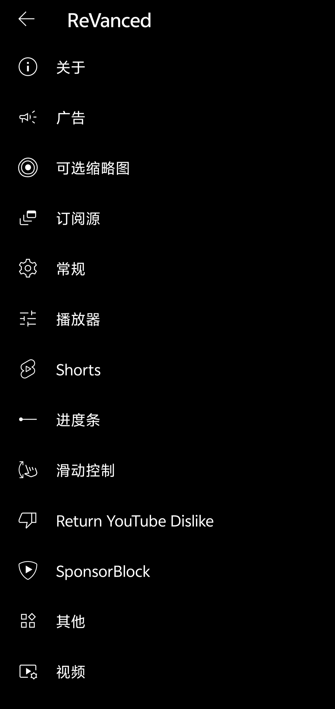
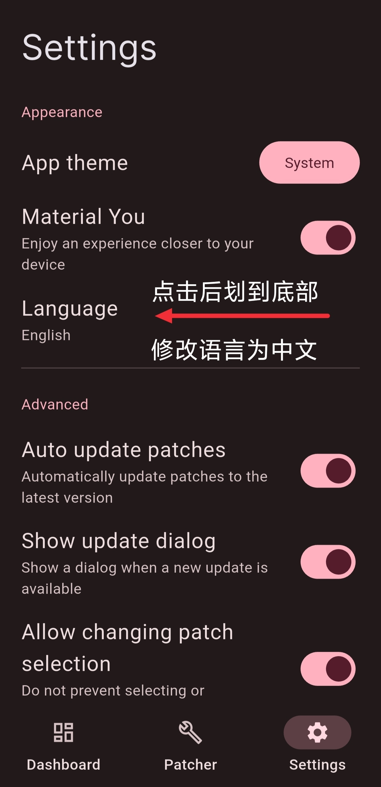
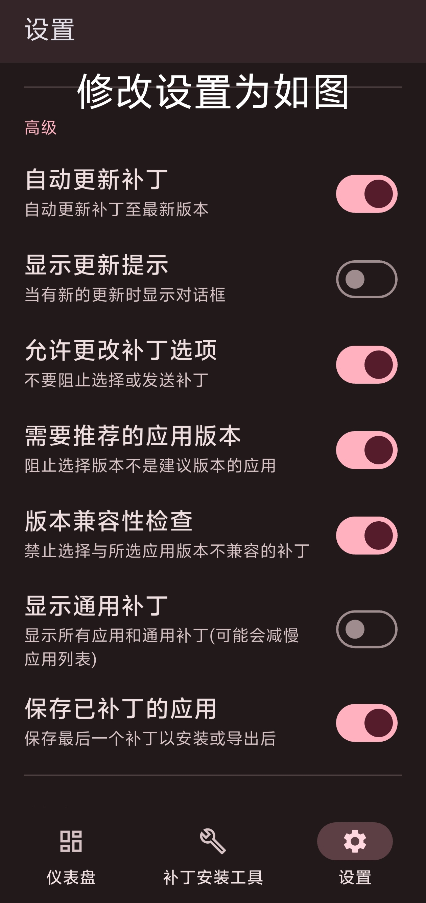
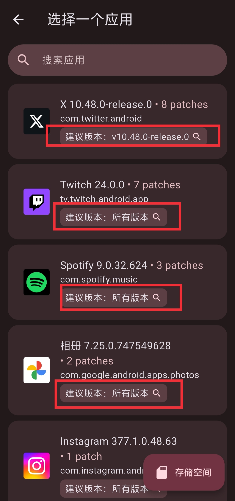
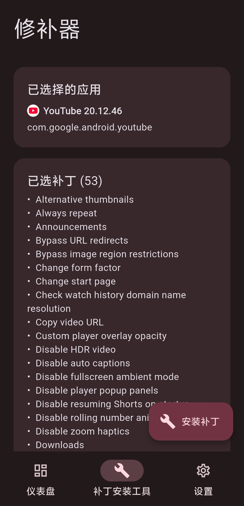

# 闲言碎语
自从**K60**被赵主任收了之后
~~跟风~~买了个iQOO我就几乎不关注搞机圈了
好巧不巧 最近小米解锁BL政策又缩紧了
现在甚至判断你在社区的“不当言论”~~（文字狱是吧）~~
不过我还是挺想念之前Root完库库刷模块的乐趣的
# 项目介绍
[Revanced Manager](https://github.com/revanced/revanced-manager "Github仓库")
一个用于YouTube等国外应用的模块化补丁
与XPosed的模块注入不同 Revanced在APK上直接修改定制功能
Revanced修补后的APK可直接用于非Root设备上
而无需XPosed的复杂流程操作（其实Root就算是国内用户最大的门槛了吧）
当然 因为只在**APK层面**动手 所以绕绕会员限制之类的就好了
~~别告诉我你想自定义系统级设置~~

# 功能示例
| 软件名       | 功能补丁                            |
|:---------:|:-------------------------------:|
| X/Twitter | 自定义主题/去除广告/解锁下载视频和GIF/隐藏推荐用户 等|
| Spotify   | 自定义主题/解锁会员功能                    |
| Youtube   | 去除广告/自定义主题/解锁高画质/解锁会员功能 等50余种功能|

  
  

# 使用教程
推荐看看某大佬的[视频教程](https://www.bilibili.com/video/BV1Jp42117um/)

- 安装Revanced Manager
[官网链接（推荐）](https://revanced.app/download)
[Github Release](https://github.com/ReVanced/revanced-manager/releases/latest)
- 修改App设置
**按下图修改设置**

  
  
  

- 下载安装包
在上右图中找到需要修补的App并点击**建议版本**
跳转到浏览器后选择一个下载渠道并下载安装包
若安装包文件格式**不为.apk**
而是xapk/apkm格式 我愿称之为复合apk（本质上也确实是多个apk缝一起）
解决方案：下载**MT管理器** 点选该文件后点击“转为apk”的选项

- 修补安装包
有了apk文件后回到右图界面点击**存储空间** 找到apk文件并选择

出现如图则可进行修补操作
直接点击右下角的**安装补丁**使用推荐补丁配置
或者点击**已选补丁**自行选择
修补过程可能较慢 **保持前台运行** 
修补完成后点击右下角的**安装** 若点击后没有跳转安装被直接打断且日志出现**Install canceled**的字样 返回到主界面**重新修补** 如多次修补失败则可能是设备或选择的app版本不兼容

# 后话
算是这个博客第一篇比较认真的教程向文章 选了个比较简单的研究 
近期应该会发篇关于赛博酒馆[SillyTavern](https://github.com/SillyTavern/SillyTavern)
btw我知道这玩意的一些用途“不太好” 不过光配置api和提示词预设就有很多值得研究的东西了
Enjoy.